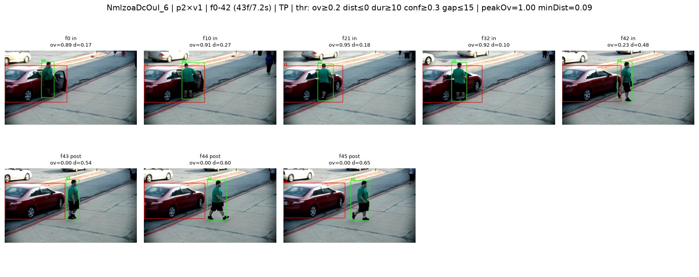

# Anat Shkolyar - Person-Vehicle Interaction Task

This is a high-level description + setup and run instructions for my results.
Detailed description in the write-up file.

## Description (High-Level)

1. Detection and Tracking - using Ultralytics YOLO11 + the built-in **BoT-SORT** tracker
   (has camera-motion compensation, which helps the PTZ/aerial clips). Pretrained model
   (COCO), using person and car/truck/bus/boat classes.
2. Extract features from the tracked objects: for every (person, vehicle) pair over time,
   the **normalized overlap** (box intersection ÷ person-box area), the **normalized
   center-distance** (÷ vehicle-box diagonal), and the per-frame **detection confidences**.
3. Extract interactions based on metric thresholds (thresholds found using LOSO - see
   write-up file): a candidate is a pair that stays in contact (overlap/distance) for a
   minimum duration above a confidence floor, with short gaps bridged.
4. Get descriptions for the objects involved in the interaction (open-vocab YOLO-World by
   default, or a moondream2 VLM).

Details on the development are in the write-up: [WRITE_UP.md](WRITE_UP.md).

## TLDR - How to run it

### Environment Setup

Python 3.12. Development was **CPU-only**, so that is the tested path — the GPU install below
is provided for convenience but is **not verified here**, so no promises it behaves identically.
Install torch first, then the pinned dependencies:

```
python -m venv .venv
source .venv/bin/activate

# CPU-only (tested):
pip install torch torchvision --index-url https://download.pytorch.org/whl/cpu
# --- or --- GPU / CUDA (untested here):
# pip install torch torchvision            # default CUDA build from PyPI

pip install -r requirements.txt
```

External model weights download automatically on first use (no manual step):

- `yolo11l.pt` — the detector.
- `yolov8s-world.pt` — YOLO-World, for the fast (`--fast`) descriptions.
- `moondream2` (@ 2025-06-21, ~3.7 GB) — for the detailed (`--detailed`) descriptions.

### Run Instructions

Full pipeline (detect + track → classify → describe) on a single clip or a whole folder:

```
python -m scripts.detect_interactions path/to/video/folder    # every .mp4 in the folder
python -m scripts.detect_interactions path/to/video/clip.mp4  # a single clip
```

Only `.mp4` inputs are supported for now; any other file (or a single non-mp4 path) exits
gracefully with a clear message instead of crashing.

Description backend for the full run: `--fast` (YOLO-World open-vocab, the default) or
`--detailed` (moondream2 VLM, slower but richer). If the chosen backend cannot load, it falls
back to model-free placeholder labels with a warning. Other flags: `--results-dir`, `--force`
(re-detect, ignoring the cache).

Full `run` help (`python -m scripts.detect_interactions run -h`):

```
usage: detect_interactions.py run [-h] [--results-dir RESULTS_DIR] [--force]
                                  [--fast] [--detailed]
                                  path

positional arguments:
  path                  A video file or a folder of videos.

options:
  -h, --help            show this help message and exit
  --results-dir RESULTS_DIR
  --force               Re-detect even if tracks are cached.
  --fast                Fast YOLO-World open-vocab descriptions (default).
  --detailed            Detailed moondream2 VLM descriptions (slow, higher
                        quality).
```

The two stages can also be run on their own:

```
python -m scripts.detect_interactions detect-and-track <video|folder>  # video -> tracks
python -m scripts.detect_interactions classify-tracks <tracks|folder>  # tracks -> results
```

Runtimes (CPU): detection + tracking dominates (per-frame inference at `imgsz=1280`) — the
4K aerial clip is by far the slowest, the small CCTV clips are quick. `--detailed` is the
other slow part (the VLM runs ~minutes per crop). A per-stage timing table + analysis is in
[`docs/timing_findings.txt`](docs/timing_findings.txt) (produced by `python -m scripts.time_pipeline`).

## My Outputs

Per-clip results are committed under [`outputs/`](outputs/) (one folder per clip). Running
the pipeline yourself also writes them to the git-ignored `cache/results/<clip_id>/`.

Each clip writes a timestamped JSON, `<clip_id>_interactions_<YYYYMMDDHHMM>.json`. Example
(illustrative):

```json
{
  "clip_id": "NmlzoaDcOuI_6",
  "generated_at": "2026-08-04T20:00:00",
  "interactions": [
    {
      "clip_id": "NmlzoaDcOuI_6",
      "person_id": 2,
      "vehicle_id": 1,
      "start_frame": 0,
      "end_frame": 42,
      "start_seconds": 0.0,
      "end_seconds": 7.0,
      "person": "a man in dark clothing",
      "vehicle": "a silver sedan"
    }
  ]
}
```

Each interaction carries the clip id, the person and vehicle **track ids**, the **frame
range** and matching **time span** (seconds), and a short **description** of each.

To visualize an interaction, `show_interactions` renders annotated contact sheets (person
in green, vehicle in red, drawn across the span plus context frames):

```
python -m scripts.show_interactions [--clip <clip_id>]
```

Sheets are written to `cache/viz/interactions/`; rendered sheets for every clip (and the
external test clip) are committed under [`outputs/sheets/`](outputs/sheets/). Example — the
`NmlzoaDcOuI_6` person↔car interaction (person 2 × vehicle 1, frames 0–42):


