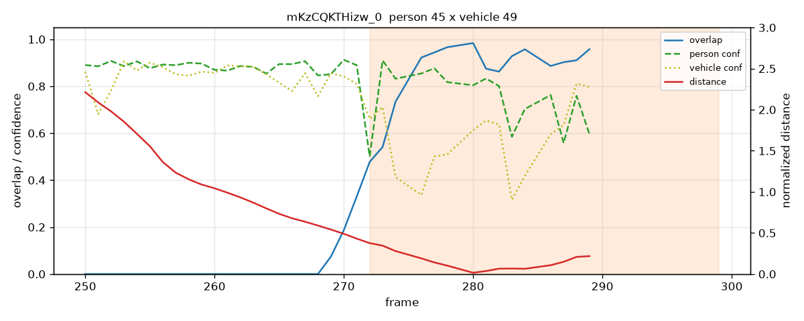
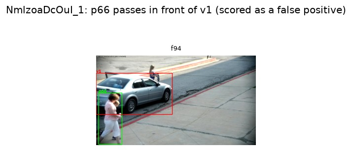
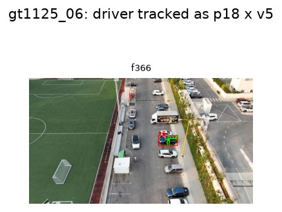
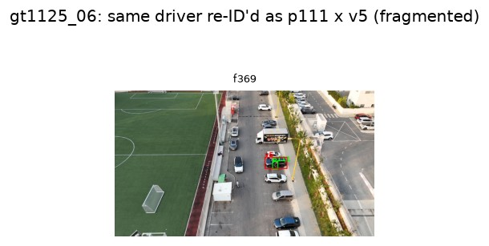
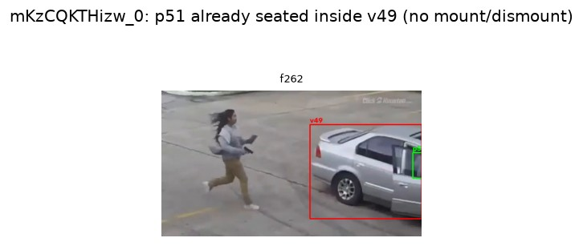

# Anat Shkolyar - Person-Vehicle Interaction Task (Detailed Write-Up)

This is the detailed write-up of the work process. For the one-page executive summary, see
[WRITE_UP.md](../WRITE_UP.md).

NOTE: I worked on my personal laptop which is CPU-only. 
This affected some decisions and (of course) runtime.
My focus was on an offline pipeline, not real-time, due to these limitations.

## Overall Development with Claude Code

I made sure to define what I want to do, then I reviewed any suggestions made by Claude.

**There was no "paste the task into Claude and just let it run free".**

Lots of code files - I asked Claude to separate as much as possible to make it easy for me to review.
And I also asked Claude to work TDD, so this explains the amount of test files.

I used [PLAN.md](PLAN.md) to define what I want to do, then had a local (untracked) handover file to track the current status of all tasks between sessions.
Any decisions were logged in [WORKLOG.md](WORKLOG.md), so they will be available for summarization in this write-up.

I asked Claude to create small PRs for each feature and reviewed those as I would for any colleague.

## Ground Truth

I had several GT overview sessions, where I asked Claude to track my observations.
I reviewed all the clips and other images myself.

1. Watching and describing each of the video clips provided (see [ground_truth/ground_truth.md](../ground_truth/ground_truth.md)), including descriptions of the scene, the camera used, and estimating start/end of interaction based on video timestamp - this was done first.
2. Going over all of the relevant objects detected in each clip, noting where tracking broke down. (see [ground_truth/tracking_notes.md](../ground_truth/tracking_notes.md))
3. Fine-tuning the GT - asked Claude to show me frames around the start/end of the GT I indicated before, selected exact frames for interaction start/end.

I also recorded the **scope decisions** in the GT file: interaction *types* are enter / exit / other (with `other` reportable behind a flag; default broad); a "vehicle" is the COCO `car` class only (every interaction here is with a car); and a *merge rule* treats consecutive engagements by the same person with the same vehicle whose boxes never separate as a single interaction.

The 8 clips are deliberately varied, which is what makes the task hard: fixed CCTV, 4K aerial/drone, PTZ/moving, and indoor-ceiling cameras; night and day; resolutions from 4K down to 352×288; plus jump-cuts, occlusions, truncated events, a driver swap, concurrent interactions on one car, and pass-by hard negatives. Two pairs share a scene (`mKzCQKTHizw_0`/`_1`, same scene different angle; `NmlzoaDcOuI_1`/`_6`, same camera different car), so the evaluation groups them into **6 scene units** and the LOSO folds hold out a whole scene at a time - tuning never sees a sibling angle of the clip it is scored on (no leakage).

## Pipeline Description

The first architectural decision was **classic detect → track → reason vs. an end-to-end
video/VLM model**. I chose the classic pipeline deliberately: it is deterministic and
reproducible (the brief's explicit priority), each stage is inspectable and cacheable, and it
degrades gracefully - a description model can be swapped or dropped without touching the
detection logic. An end-to-end learned interaction model is noted as a separate future direction
(see Future Improvements), but it needs large amounts of labeled data and is far less transparent.

After going over the videos and describing them, I defined the work plan.

### Detection and Tracking
I have chosen to use a pre-trained model, Ultralytics' YOLO11, for object detections.
I have worked with these models in the past and feel that their framework is easy and flexible enough for many tasks.
I did weigh newer alternatives - YOLO26 (NMS-free, strong on small objects) and RT-DETR - but chose YOLO11 to de-risk (mature, well-supported); the newer detectors are noted as a recall experiment in Future Improvements.
(NOTE: Ultralytics is AGPL-3.0, so a license is required for commercial use; this also covers the YOLO-World model used for the `--fast` descriptions. The `--detailed` captioner, `moondream2`, is Apache-2.0. Everything runs locally - no external services or network APIs.)

Claude suggested using the built-in tracking option with **BoT-SORT** tracker, as it has compensation for camera motion --> I accepted the suggestion.

There were several discussions on how to save the tracking outputs; I tried to keep it simple (**CSV** for the per-frame tracks, plus a JSON metadata sidecar and a JSONL raw-detection cache - as opposed to Claude suggesting parquet) and defined the output format.

Claude wrote the code for the detection and tracking, and ran it over all the videos.

The detection takes most of the runtime (on CPU) and is heavily dependent on frame count (not resolution - see [docs/timing_findings.txt](timing_findings.txt)).

### Note on Detection quality
Some objects were missed at the detection stage.

Example - in the low quality CCTV video (`HIu4lM4B8hA_1`, low-res grayscale night), the car was not detected at first (when used the "car" class alone). When I examined the full, unfiltered detection, it turns out it was identified as "boat".
As a workaround, I made sure that "truck" and "bus" are added to "car" as the default vehicle class.
For the specific video, I added an override that allows "boat" be counted as a vehicle for this video alone, along with a TODO that in the future this workaround should use the video properties to select the "low-quality-so-expand-definition-of-vehicle" route instead of hard-coding by video name.

In the same video, the man stealing the vehicle is barely detected - only fleetingly (a couple of frames), and not at all through the actual entry.
In another video (`iMGR_0AG3a8_2_3`, the indoor parking garage) - a woman exiting a car is not detcted at all.

The YOLO model was probably **NOT** trained on CCTV videos, at least not exclusively.
In the future, it may be beneficial to fine-tune / use models specifically trained on CCTV footage (or any other footage the customers provide) to improve detection (see Future Improvements below).

Additionally, I'm no expert on tracking, but there are many tracking modules (or even video-ingesting models) to choose from, so this is another possible future optimization.

## Extracting Interactions
The first question here was "What defines a person-vehicle interaction?".

Programatically - it must have the person and vehicle bounding boxes in close proximity, and for a meaningful amount of time.
It also required the model to be confident in the object detection
I defined several parameters that may indicate an interaction and asked Claude to extract those per clip.

The parameters, per (person, vehicle) pair over time: **normalized overlap** (box intersection ÷ person-box area - the fraction of the person inside the vehicle box), **normalized center-distance** (÷ vehicle-box diagonal, so it is scale-invariant), and the per-frame **detection confidence**; plus temporal gates - a minimum **duration** in contact and a maximum **gap** bridged. These signals per pair vs the GT windows can be plotted with `scripts.plot_signals`. For example, the woman entering the gray car in `mKzCQKTHizw_0` (person 45 × vehicle 49): the normalized overlap climbs toward ~1.0 right over the GT interaction window - **the dark shaded band in the plot** - while the normalized distance drops. That separation is what the thresholds key on.

Next, I ran a LOSO (leave-one-scene-out) to find the thresholds per-fold. This showed the approach had merit.
I fit a set of global thresholds on all clips together - these are the thresholds set in config ([`config.SHIPPED_THRESHOLDS`](../person_vehicle_interactions/config.py)): `min_overlap=0.2`, `max_distance=0.0`, `min_duration_frames=10`, `min_confidence=0.3`, `max_gap_frames=15`.

Reassuringly, these thresholds are not overfit to any one scene: **5 of the 6 LOSO folds produce a threshold set identical to the shipped one**. Only the grayscale-CCTV fold (`HIu4lM4B8hA_1`) differs - it wants `min_confidence=0.0` where the shipped set uses `0.3` - and there the shipped floor actually drops one false positive. So a single global threshold set generalizes across the held-out scenes rather than needing per-scene tuning (comparison via `scripts.compare_thresholds`).

I also took a video of people exiting a car with my phone, downsampled it and used it as an external sanity test for the thresholds. There were no surprises: on this fully held-out clip (4 people exiting one dark car) the pipeline emitted 14 candidate windows, reproducing the same fragmentation and pass-by false-positive behavior seen on the provided clips rather than anything new. I won't show the images here as the people in the video did not consent to being filmed.

The pipeline reports interaction **candidates** (the person↔vehicle contact window); classifying each as enter / exit / other was scoped out - the brief only asks to *list* interactions - though the GT annotates the type, so it is a natural next step.

Each output record is **one person paired with one vehicle**: concurrent people around the same car become separate records (each with its own person description), rather than a single record listing several people. The brief allows "person(s)", so grouping simultaneous participants into one interaction is a reasonable alternative - deferred (see Future Improvements).

## Analyzing the Interactions + Descriptions

On the ground truth, the pipeline finds most real interactions: leave-one-scene-out (leakage-free) gives overall **precision 0.62 / recall 0.77 / F1 0.69** (10 TP, 6 FP, 3 FN across the 6 scenes), evaluated against the 13 annotated GT interactions (6 enter, 6 exit, 1 other). The recall miss is mostly the two detection failures noted above; the false positives are mostly **split interactions** (one real interaction fragmented across track-ID switches) plus a couple of hard pass-bys.

Going over the interactions highlighted the broken tracking - same interaction was split into several sections.
My idea was to use the Description section to help filtering FPs and unifying segmented interactions.
My assumption was that same person + same vehicle, in a given time range = same interaction, despite tracking issues, and that if the descriptions are detailed enough they may indicate "person walking past a car" or "person getting into a car", or even just answer a yes/no question of "is there a person touching a car in this image".

I tasked Claude to find suitable models for image descriptions. We started from YOLO-World, whose attributes proved unreliable - it does emit colors and gender guesses, but they are frequently wrong (it labelled a man in a green shirt as "a woman" and a red sedan as "a red SUV"); it is more dependable on object *type* (sedan/SUV/truck). I asked to switch to a captioner model, Claude suggested `moondream2` from HuggingFace, which showed promise (it described that same clip as "Male, wearing green" and "Red four-door sedan" - matching the GT), but was very slow on CPU - more than a minute per image (per crop; descriptions are deduplicated per track, so each unique person/vehicle is described once, not once per interaction).

For this task, I created 2 options for descriptions - one `--fast` using YOLO-World, just for the feeling of sane runtime and `--detailed` where `moondream2` was used, for usable descriptions.

I decided not to filter out FPs (for example, a woman walking in front of a car and not interacting with it in video `NmlzoaDcOuI_1`, which `moondream2` correctly described as "passing by" when asked, on the union crop of the person + vehicle boxes, whether she was interacting or just passing by).
I also decided not to unify split interactions at this time, as YOLO-world cannot be depended on and `moondream2` is too slow.

## Limitations

- **Single-camera ambiguity / identity-blind scoring:** a person passing *in front of* a parked car overlaps its box and can be scored as an interaction (the `NmlzoaDcOuI_1` passer-by, below). Evaluation also matches predictions to GT by temporal overlap, not identity, so it can mislabel in either direction.

  

- **Broken tracking → fragmentation:** ID switches split one real interaction into several windows (the aerial `gt1125_06` driver, below), which is the main source of false positives. The same driver on the same car `v5` is tracked as `p18` and then re-identified as `p111`:

  
  

- **Static occupant:** a person already seated inside a car has sustained box overlap with no mount/dismount, so overlap alone can mistake them for someone entering (`mKzCQKTHizw_0` `p51`, seated in `v49`):

  

  The fix is to key on the **transition** rather than the level: an *enter* is an overlap that rises low→high and a *exit* falls high→low, whereas a seated occupant stays flat-high. That same rising/falling signature is also what would drive the enter/exit/other typing I scoped out - one signal addresses both the false trigger and the missing interaction type.

- **CCTV detection recall:** low-res / grayscale clips (`HIu4lM4B8hA_1`) miss people and misclassify cars (the `boat` case), capping recall regardless of the interaction logic.

## Reproducibility

Models and seeds are pinned and the detector/tracker run CPU-deterministically; the `moondream2`
descriptions rely on the model's default greedy decode (no sampling) rather than an explicitly
fixed generation seed. The detection **tracks** and the **results** are committed under `outputs/`,
so a reviewer can reproduce the classify + description stage (and the contact sheets) without
re-running the ~73-minute detection.

The committed `outputs/` hold **15 interactions across the 8 clips** under the single shipped
threshold set (`config.SHIPPED_THRESHOLDS`); `HIu4lM4B8hA_1` contributes **0** (the documented
CCTV detection-recall miss, not a broken run). The precision/recall/F1 above is a separate,
leakage-free LOSO **evaluation** device and is not what produces these shipped outputs - so its
window counts (16 predictions vs 13 GT) are not expected to match the 15 committed interactions.

## Last Minute Checks

As a last-minute check while reviewing before the interview, I noticed the shipped thresholds
sit at the edge of the parameter search grid on every axis, so I widened the grid a little to
see whether a better parameter set exists. It turns out there was one:

| | F1 | Precision | Recall | TP / FP / FN | thresholds |
|---|---|---|---|---|---|
| Shipped | 0.71 | 0.67 | 0.77 | 10 / 5 / 3 | overlap 0.2, dist 0.0, dur 10, conf 0.3, gap 15 |
| Best of widened grid | 0.85 | 0.85 | 0.85 | 11 / 2 / 2 | overlap 0.4, dist 0.0, dur 3, conf 0.5, gap 15 |

(Both fit and scored on all clips, the same protocol that produced `config.SHIPPED_THRESHOLDS`;
this is an in-sample fitting comparison, not a leakage-free LOSO number. See
`scripts/widen_grid_experiment.py`.) The new optimum lands in the interior of the widened
ranges rather than back on an edge, so the widening was enough to capture it. The reported
results elsewhere in this write-up are still for the previously shipped thresholds.

# Future Improvements

1. Detection / tracking
    1. Detection model trained on CCTV and other suitable footage
    2. Better tracking module
    3. A video-native model that detects + tracks jointly (e.g. transformer trackers such as MOTR / TrackFormer, or open-vocabulary video models) instead of per-frame detection + a separate tracker.
2. Definition of Interaction 
    1. Is a person removing a car cover considered an interaction? 
    2. Tuning / replacing selected interaction parameters based on more data
    3. Address more edge cases - multiple people interacting simultaneously with a vehicle - is it one or multiple interactions?
3. Descriptions
    1. Using GPU for faster image descriptions
    2. Using descriptions to filter out FPs
4. A completely other direction - train a model that identifies interactions within videos - requires large amounts of labeled data.

